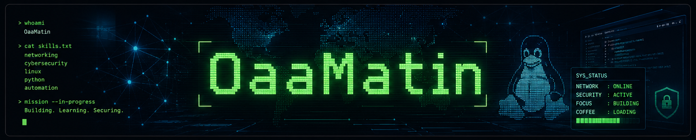

<div align="center">



# Hi, I'm Matin 👋

[](https://git.io/typing-svg)
[](https://www.linkedin.com/in/matinostadaliakbari)
[](mailto:matinostadaliakbari1385@gmail.com)
[](https://t.me/Matin_OAA)

</div>

<br>

## 💫 About Me

I'm a Computer Engineering student focused on understanding how networks work and how they can be secured. I like building real-world networking tools with Python and Linux, exploring both offensive and defensive security concepts, and I'm currently expanding into backend development with **.NET / ASP.NET Core**.

I learn best by building — most of my projects start as "let me see how this actually works" rather than following a tutorial line by line.

<br>

## 🚀 Current Focus

```text
🌐  Computer Networks
🔐  Cybersecurity (offensive & defensive fundamentals)
🐍  Python
🧩  .NET / ASP.NET Core
🐧  Linux
```

<br>

## 🛠 Tech Stack

<div align="center">


</div>

<br>

## 📊 GitHub Stats

<div align="center">


</div>

<br>

## 🔥 GitHub Streak

<div align="center">


</div>

<br>

## 📈 Contribution Graph

<div align="center">


</div>

<br>

<div align="center">

*Always down to talk networks, security, or backend dev — feel free to reach out.*

</div>
